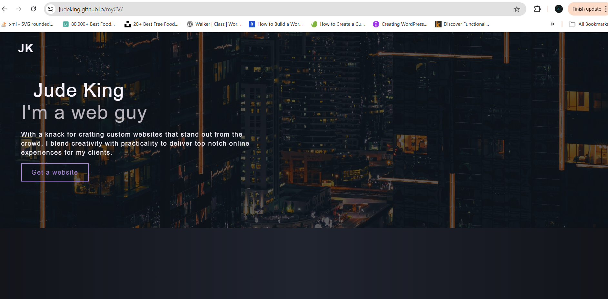

# JudeKeaton Portfolio Website

This project is a personal portfolio website for Jude Keaton, showcasing web development skills, experiences, and projects. The website is built using HTML, CSS, and JavaScript, with a focus on clean design, smooth animations, and interactive elements.

## Features

* **Responsive Design**: The website is full responsive and adapts to different screen sizes.
* **Smooth Animations**: Custom animations are used throughout the website for a dynamic user experience.
* **Skills Display**: A dedicated section for featured projects, including links and descriptions.
* **Contact Section**: Highlights of technical skills with progress bars.
* **Glitch and Slide Animations**: Adds a unique visual flair to the headings and content.

## Technologies Used
* **HTML5**: The structure of the website.
* **CSS3**: Styling, including animations and responsive design.
* **JavaScript**: Intereactive elements and animations.
* **Font Awesome**: Interactive elements and animations.

## Installation
To run this project locally:
1. Clone this repository:
`git clone https://github.com/JudeKing/myCV.git`
2. Navigate to the project directory:
`cd myCV`
3. Open `index.html` in your preferred web browser.

## Usage
Once the website is running, you can explore the different sections:
* **Home**: A brief introduction and a call to action to get a website.
* **About**: A detailed description of Jude's background, skills, and journey.
* **Projects**: Featured projects with descriptions, images, and links.
* **Contact**: Information on how to get in touch via email.

## Author
**Jude King**
